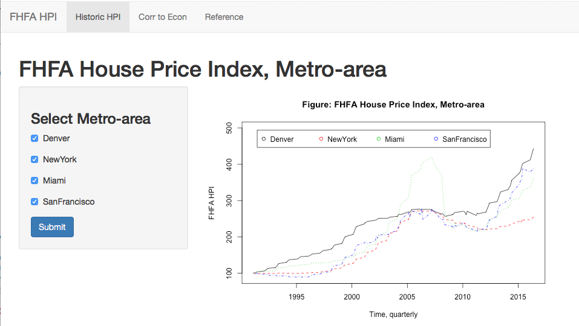
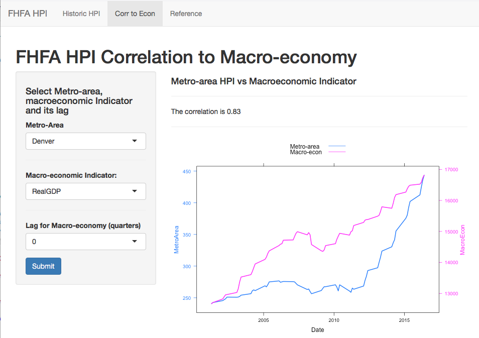
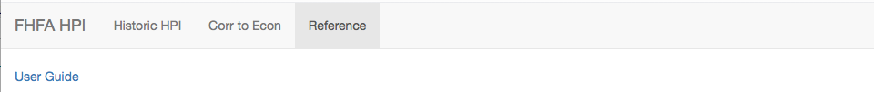

## FHFA HPI app
* Federal Housing Finance Agency, House Price Index.

* Objective.

        - Create a shiny app and publish it
        - Provide user-guide documentation for the app; attach it to the app
        - Write a 5 page presentation to pitch your app
        
* APP provides to the user the functionality to

        - Compare house price indexes across metro-areas
        - Compare and correlate the trends in the house price indexes to the economy
        - Attach any useful white papers and documentation as a reference

* The app does this in three tabs
* Note: this is a simple app, so for example we did not use any fancy transformations of the HPI or macro-economic indicators (where one should, when looking for dependencies)


--- .class #id 

## Tab 1: Historic HPI
* Comparison of historic trends in HPI across metro-areas
* Make a selection via the check-boxes for the metro-areas to compare

```{r, out.width = "800px",echo=FALSE}

```

--- .class #id 

## Tab 2: Corr to Econ
* Look for correlations between HPI and the macro-economic indicators.
* Left - select a metro-area, macro-economic indicator, and a lag for the latter
* Right - compare trends and see correlation coefficient

```{r, out.width = "550px",echo=FALSE}

```

--- .class #id 

## Tab 3: Reference
* Tab3 contains any referenced white papers and documentation. 
* The user-guide (pdf) is attached here

```{r, out.width = "800px",echo=FALSE}

```

* ui.R and Server.R located <a href="https://nikdobri.shinyapps.io/fhfa_hpi_app/">here</a>
* The code for the slidify preentation is located <a href="https://nikdobri.shinyapps.io/fhfa_hpi_app/">here</a>
* App and documentation located <a href="https://nikdobri.shinyapps.io/fhfa_hpi_app/">here</a>

* Note:

        - I hope this was useful information
        - Miami and NY have not caught up to pre-recession prices
        - Yes, the economy seems to be correlated to the house prices. 

